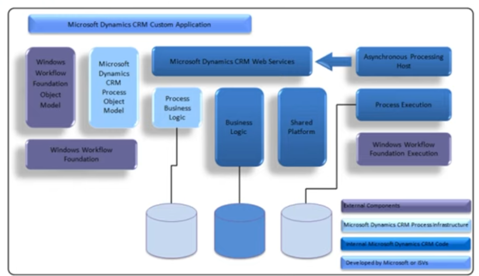

# Index Dynamics
2023-04-20
tags: [-Index CSharp](../-Index%20CSharp.md) 

O dynamics é uma plataforma low-code que facilita com soluções prontas aplicações, possuí banco de dados da Azure integrado além de máquinas virtuais e mais.

OOB = recursos nativos
xRM = Uma relação extendida, isso significa que você se relaciona com todos os papeis no seu negócio, empresários, bancos... Não só o cliente
* Possuí relacionamento com todos os apps do workflow Microsoft 365

* **Componentes Internos**: No contexto do Microsoft Dynamics, os componentes internos referem-se aos recursos e funcionalidades integrados ao sistema Dynamics e que estão diretamente relacionados às suas operações principais, como por exemplo, o gerenciamento de clientes, vendas, finanças, estoque e compras.

* **Componentes Externos**: Por outro lado, os componentes externos são complementos ou extensões que podem ser integrados ao Dynamics para expandir suas funcionalidades e personalizar suas operações. Alguns exemplos de componentes externos incluem soluções de CRM, ferramentas de gerenciamento de projetos, ferramentas de BI e outras soluções de terceiros que podem ser integradas ao Dynamics para atender a necessidades específicas do negócio.

## Arquitetura

-----------------------------------------------
## Bibliografia