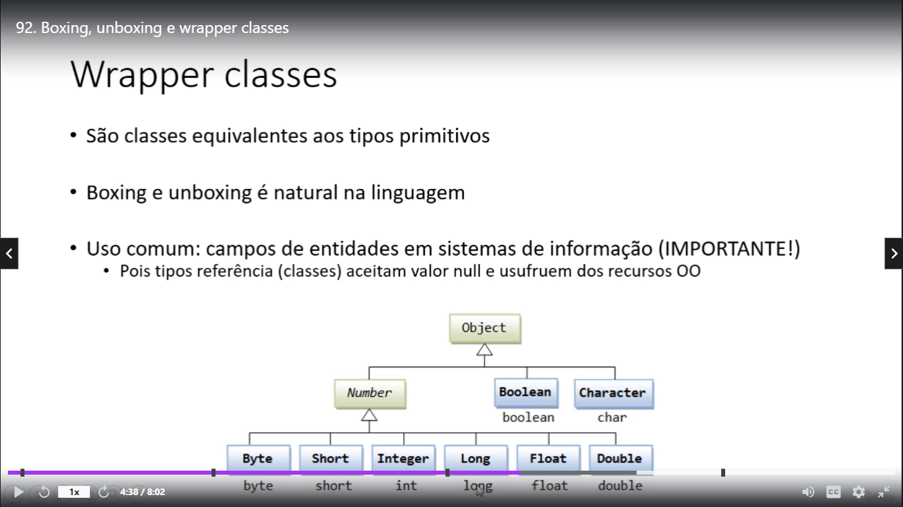

# Boxing, unboxing and wrapper classes
[Index Java](../../JavaVanilla/Index%20Java.md)
Mod 92 -- **31-01/03/22**

## Boxing e unboxing

Boxing = É o processo de conversão de um objeto tipo valor para um objeto tipo referência compatível

Relembrando, quando instanciamos uma variável nós estamos fazendo uma referência a algum objeto da memória cheap, isso se chama Boxing

Já o boxing é o processo inverso, nós colocamos numa variável o valor do objeto, é como colocar uma function em uma variável, ou um json em uma variável

então podemos fazer isso:

~~~java
import java.util.Scanner;

public class Aula37.md {

    public static void main(String[] args){

        int x = 20;
        Object obj = x

        int y = (int) obj

    }
}
~~~

## Wrapper classes

São classes equivalentes aos types primitivos

Object  
  -> Boolean  
  -> Character  
  -> Number  
    -> Integer  
    -> Double
    -> Float  
    -> Byte  
    -> Short
    -> Long

Então dando o mesmo exemplo, para não termos que fazer casting *(type)* podemos usar diretamente a classe referente ao type do objeto.

~~~java
import java.util.Scanner;

public class Aula37.md {

    public static void main(String[] args){

        int x = 20;
        Integer obj = x

        int y = obj

    }
}
~~~

!!! É importante usarmos essas classes para que os valores na variável possam ser nulos
