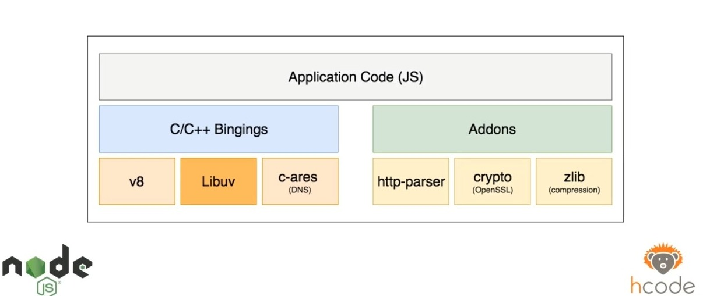

# Mods 13, 14 e 15

## Concorrência e Taxa de Transferência

Mod 13 -- **18/11/21** - feito em: **03/12/21**

### Como ganhar performance com métodos bloqueantes e não bloqueantes

Pense em uma response feita pelo usuário de um formulário, digamos que o tempo para gravar essas informações no banco, seja de 40 milissegundos e para fazer a verificação de campos seja 5 milissegundos, então numa conexão bloqueante, o total é 45 milissegundos, enquanto numa não bloqueante, apenas 40 milissegundos e a diferença de performance seria a concorrencia.

A **concorrencia** é a capacidade que o eventLoop possui de executar funções em paralelo, diminuindo o tempo de execução.  
Lembrando que p **eventLoop** é a capacidade assincrona e não bloqueante do script.

E o [**throughput**] ou **taxa de transferencia**, é o tempo de processamento em si, o tempo necessário para a execução, levando em conta como o sistema carrega as threads da linguagem.

## Cuidados ao utilizar blocking e Non blocking

mod 14 -- **25/11/21** - feito em **03/12/21**

Se um processo for fazer vários processos simultaneamente e for usar métodos non-blocking é sempre preferível usar tudo non blocking.

* Os métodos non blocking, ou seja, que não tem Async no nome, fazem tudo de fato simultaneamente então digamos que você fale para ler um arquivo com a biblioteca fs e depois, na linha abaixo, você manda apagar o arquivo, o que vai acontecer? o node vai começar a ler o arquivo como se nada tivesse acontecendo, vai mandar para a  segunda thread e depois vai ler o próximo comando, como o próximo comando é para deletar o arquivo, ele vai deletar o arquivo e por que o arquivo n existe mais, e como n existe mais arquivo, não existe mais leitura, então a thread anterior, acaba depois que o arquivo seja apagado, lendo e entregando para você, só o que ele leu do arquivo.

Então o que podemos tirar do exemplo? USE SEMPRE DE PREFERENCIA UM TIPO SÓ DE THREAD. Por que se você quer apagar o arquivo depois da leitura, sincronicamente usa os dois como método não async.

## Entendendo o Núcleo

mod 15 - **03/12/21** - feito em: **03/12/21**

### Como o Node funciona internamente?

* O V8 é uma parte do V8, ele é feito em cima do V8 e não só o V8.

* Node utiliza uma programação dirigida ao eventos.

* Ele usa métodos non-blocking.

Então o node se padecemos abrir ele, ele seria assim:

Sendo v8 só uma parte dos conteúdos que vc pode usar na sua aplicação.

Sendo por exemplo o crypto uma lib dentro do node que é parecido com o OpenSSL, então o node é bem mais que só o V8. E esse módulos só vão ser usados caso você requisite um deles, sendo a Libuv por exemplo, quem cuida dos métodos blocking e unblocking.

### IO do node.js

IO é uma sigla para input e output, no pt-br damassa, Input e Output e isso pode ser o input de qualquer coisa e o output de qualquer coisa, exemplos:

* File System
* Network (response, request)
* Dns

Mas como eu posso fazer tudo isso em todas as plataformas, como um Linux ou um windows, porque estamos falando de uma linguagem de programação que trabalha nessas três áreas de forma simultânea, é ai que entra a libuv, ela é responsavel por carregar toda essa informação de forma fluida, ela é feita toda em c++ traduzindo a linguagem javascript para uma linguagem de máquina.
