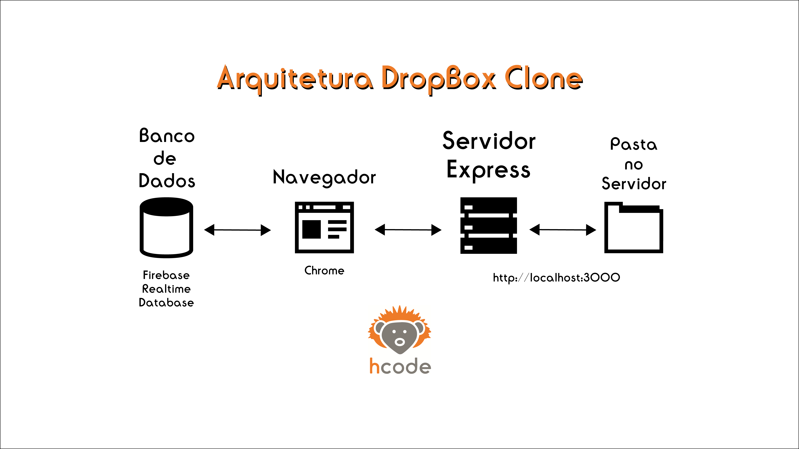

# Inicializando o projeto Dropbox Clone
[IndexJs](../IndexJs.md)

Mod 89 -- **03/12/21**

Vamos usar firebase para fazer o DataBase desse nosso projeto Dropbox clone, como apresentado na figura abaixo. Então como estamos usando o firebase, o firebase vai fazer todo o processo que um backend faria, então ele vai diretamente se comunicar com o banco de dados.  
O firebase é incrivel para real-time applications, já que lida muito bem com vários processos ocorrendo ao mesmo tempo.

Com o tempo vamos usar outra imagem de arquitetura, já que a arquitetura de software vai se moldando conforme o projeto.
