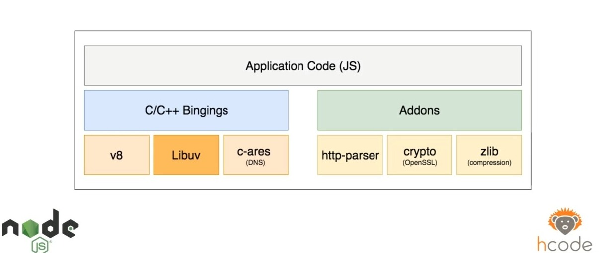

# Node.js

O Node é uma plataforma de execução do javascript do lado do servidor. Ele é basicamente uma interpretação do motor V8 para interpretar javascript fora do ambiente do browser. Assim como o V8 do chrome, tem outros motores de interpretação, como o Spider Monkey do Firefox, o Chakracore do edge....

Contudo, o grande barato do nodejs é a capacidade dele de fazer conexões muito rápidas e trazer o js para fora do ambiente web.

## Como o Node funciona internamente?

* O V8 é uma parte do V8, ele é feito em cima do V8 e não só o V8.
* Node utiliza uma programação dirigida ao eventos.
* Ele usa métodos non-blocking.

Então o node se padecemos abrir ele, ele seria assim:

Sendo v8 só uma parte dos conteúdos que vc pode usar na sua aplicação.

### A LibUv e o EventLoop

O eventLoop funciona de uma forma muito interessante, existem loops de funções que chamam outras funções até cumprir algum requisito numa ordem de checks, por isso é single thread e tão rapido.
Sendo por exemplo o crypto uma lib dentro do node que é parecido com o OpenSSL, então o node é bem mais que só o V8. E esse módulos só vão ser usados caso você requisite um deles, sendo a Libuv por exemplo, quem cuida dos métodos blocking e unblocking.

## IO no node.js

IO é uma sigla para input e output, no pt-br damassa, Input e Output e isso pode ser o input de qualquer coisa e o output de qualquer coisa, exemplos:

* File System
* Network (response, request)
* Dns

Mas como eu posso fazer tudo isso em todas as plataformas, como um Linux ou um windows, porque estamos falando de uma linguagem de programação que trabalha nessas três áreas de forma simultânea, é ai que entra a libuv, ela é responsavel por carregar toda essa informação de forma fluida, ela é feita toda em c++ traduzindo a linguagem javascript para uma linguagem de máquina.