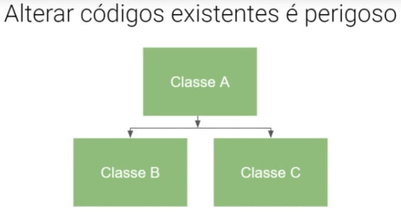

# SOLID
2023-07-24
tags: [-Index design patterns](-Index%20design%20patterns.md)

## S = Single responsibility principle

> "Nunca deve ter mais de um motivo para uma classe mudar"

As suas classes devem ter responsabilidades únicas. Uma classe não pode ser uma classe para mandar as coisas para o banco de dados e ao mesmo tempo controlar o client do site, não faz sentido, temos que fazer uma relação de ingeção de dependência.

Exemplo: Vamos criar uma classe Client que pode criar um upload, fazer um delete, um read e mandar um email para a empresa.

~~~ts
export interface IClient {
    name :string;
    email :string;
    password :string;
}

export default class User{

    constructor(private userData :IClient){
    }

    // main methods
    create() :void{ // ... }
    read() :void{ // ... }
    update() :void{ // ... }
    delete() :void{ // ... }
    
    // getters and setters
    getEmail() :string{
        return this.userData.email
    }
}
~~~

Opa, se você não sentiu que `sendEmail` está desalocada, significa que você não conhece o SRP, mandar um email, não é de função do cliente, o client deve ser um CRUD.
Embora o client possa mandar um email, `sendEmail()`, deve ser mandada para uma classe de fora, como por exemplo uma classe notify que tem o interesse de notificar o cliente. 
Você percebe a sutil diferença? A classe client não tem mais a responsabilidade primária, o User é para os métodos básicos do user, não para notificar ele, fica mais adequado existir um método de notify que tem a função de notificar. O client tem a função de representar o cliente, já o notify tem a função de notificar, os client não podem notificar e representar o cliente...

~~~ts 
import Client from './Client'

export default class Notify {

    constructor(private client :Client){
    }

    sendEmail() :boolean {
      try console.log(this.getClient().getEmail()); return true
      } catch(error) console.error(error); return false
    }

   // getters and setters
    getClient(){
      return this.client
    }
  }
~~~ 

Main File has to be like:

~~~ts
import{  default as Client, IClient } from './Client'
import Notify from './Notify'

const userName :string = document.queryselector('data-user-name')
const userEmail :string = document.queryselector('data-user-Email')
const userPassword :string = document.queryselector('data-user-password')

let userData :IClient = {
  "name": userName,
  "email": userEmail,
  "password": userPassword
}

const client = new Client(userData)
const notification = new Notify(client)

notification.sendEmail();
~~~

## O = Open closed principle

> Aberto para a extensão e fechado para modificação

Alterar a classe A faz a B e a C quebrarem ou precisarem de muidanças;
Implementar sem danificar a estrutura base de A, faz B e C terem mais novas possíveis funcionalidades e não serem danificadas.

É interessante que, caso exijam uda implementação que mude a classe A, crie uma classe D que receba essa funcionalidade, uma nova regra de negócio talvez que encapsule essa nova funcionalidade, como uma API.

No caso de precisar criar "subcategorias", é sempre melhor ter derivados de abstrações, é sempre melhor ter uma classe que deriva várias outras... No caso de um veículo, você cria a abstração veiculo, diz as regras de negócio que todos os veículos vão seguir e cria os veículos. Dessa forma, fica mais fácil para a extensão de novos veículos.

## L = LSP - Liskov Substitution Principle

> "Uma classe derivada pode ser substituível pela sua classe base"
> Não faça heranças sem sentido

Dois pontos a ser discutido nessa arquitetura:

* Percebe que o IPayment é mais abstrato e mais correta para as regras de negócio? 
	As duas possuem um problema... `IPayment` deveria ser pai de `ICard`... Até pela injeção de dependências, uma mudança que tem como ser paga pelo crédito não pode afetar o `Reward`, além disso, todo cartão de crédito vai precisar fazer uma consulta na API que pode ser colocada já na interface e entre outras funcionalidades...
* Percebe que faz sentido criar uma abstração? Todos os filhos sabem chamar os métodos do pai, com suas próprias funcionalidades, contudo, sabem. Dessa forma, podemos chamar o mesmo método pela mesma declaração de objeto, mas dependendo do fluxo pode ser chamada como uma instância de uma classe diferente:

~~~ts
// Digamos que já temos nossas classes

function verifyCard() :string{
	/* 
		aqui fazemos a verificação de qual 
		método de pagamento será usado
	*/
}

const card :unknow

switch(verifyCard()){
	case 'credit':
		card = new Card()
		break
	case 'debit':
		card = new Debit()
		break
	case 'reward':
		card = new RewardPayment()
		break
	default :
		throw new Error('Function not implemented')
		break
}

card.verifyPayment()
card.collectPayment()
~~~

Não importa a forma que você vá pagar, como todos os métodos de pagamentos são derivados de um único lugar, todos eles podem fazer o que o pai faz, todos eles têm os métodos: `verifyPayment()` e `collectPayment()`
